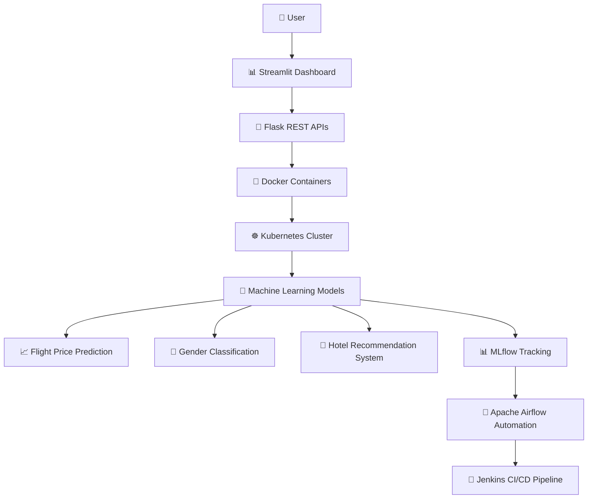

# Voyage-Analytics-Integrating-MLOps-in-Travel

## 📖 Introduction:
This project focuses on leveraging data analytics and machine learning to revolutionize travel and tourism experiences. Using datasets on users, flights, and hotels, we aim to build and deploy models for predicting flight prices, classifying user gender, and recommending hotels.

## 📋 Project Overview

Voyage Analytics is an end-to-end MLOps project designed to
analyze travel data and deploy machine learning solutions
using modern MLOps practices.

The project includes:

- Flight Price Prediction
- Gender Classification
- Hotel Recommendation System
- Flask REST APIs
- Streamlit Dashboard
- MLflow Tracking
- Docker Containerization
- Kubernetes Deployment
- Apache Airflow Automation
- Jenkins CI/CD Pipeline

## 🛠️ Technologies Used

| Technology | Purpose |
|---|---|
| Python | Programming |
| Pandas | Data Analysis |
| Scikit-learn | Machine Learning |
| Flask | REST APIs |
| Streamlit | Dashboard |
| MLflow | Experiment Tracking |
| Docker | Containerization |
| Kubernetes | Orchestration |
| Apache Airflow | Workflow Automation |
| Jenkins | CI/CD |
| GitHub | Version Control |

## 🏗️ Project Architecture

## 📂 Dataset Information

### 👥 Users Dataset

- User identifier
- Company
- Name
- Gender
- Age

### ✈️ Flights Dataset

- Flight origin and destination
- Flight type
- Price
- Duration
- Distance
- Agency

### 🏨 Hotels Dataset

- Hotel name
- Location
- Stay duration
- Pricing

## 🤖 Machine Learning Models

### 📈 Regression Model

- RandomForestRegressor
- Predicts flight prices

### 🧑‍🤝‍🧑 Classification Model

- RandomForestClassifier
- Predicts user gender

### ⭐ Recommendation System

- Content-Based Recommendation
- Cosine Similarity

## 🔌 API Endpoints

| Endpoint | Method | Purpose |
|---|---|---|
| /predict-flight-price | POST | Predict flight price |
| /predict-gender | POST | Predict gender |
| /recommend-hotels | POST | Recommend hotels |

## ⚙️ Installation Steps

### 📥 Clone Repository

git clone <repository_link>

### 🐍 Create Virtual Environment

python -m venv venv

### ▶️ Activate Environment

venv\\Scripts\\activate

### 📦 Install Requirements

pip install -r requirements.txt

### 🚀 Run Flask API

python api/app.py

### 📊 Run Streamlit

streamlit run streamlit_app/app.py

## 🐳 Docker Commands

### 🏗️ Build Docker Image

docker build -t voyageanalytics .

### ▶️ Run Container

docker run -p 5000:5000 voyageanalytics

## ☸️ Kubernetes Commands

kubectl apply -f kubernetes/deployment.yaml

kubectl apply -f kubernetes/service.yaml

## 🔄 Apache Airflow

Apache Airflow is used to automate:

- Data preprocessing
- Model training
- Model evaluation

## 🚀 Jenkins CI/CD

Jenkins pipeline automates:

- Dependency installation
- Model testing
- Docker image building
- CI/CD workflow

## 🔮 Future Improvements

- Cloud Deployment
- User Authentication
- Deep Learning Models
- Real-Time Recommendations
- Monitoring and Logging
- Automated Retraining
